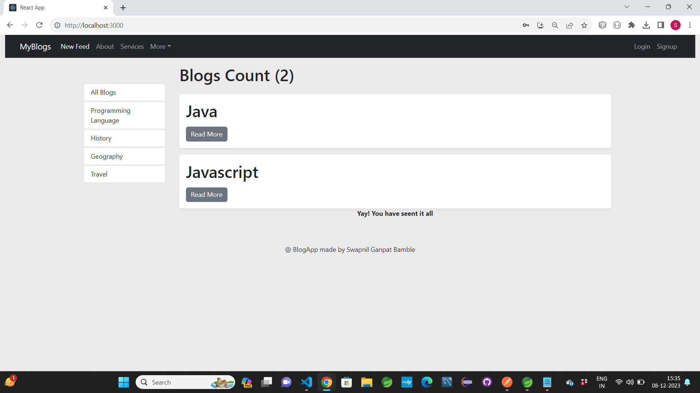
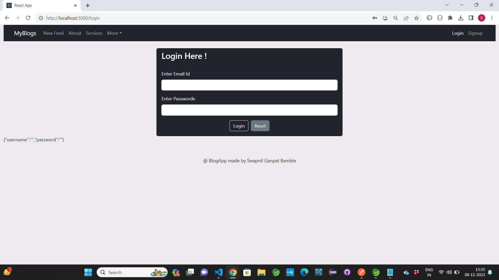
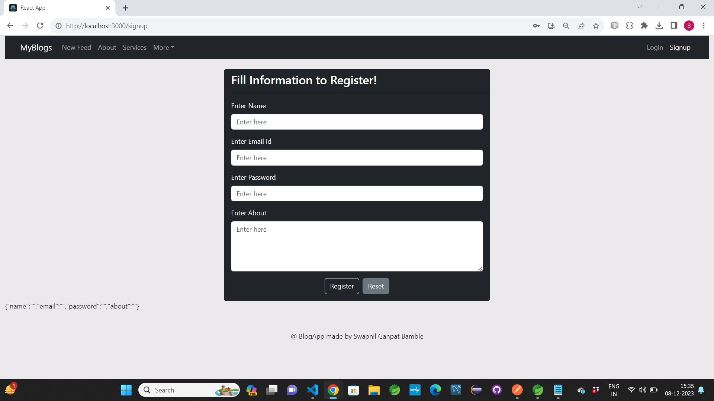
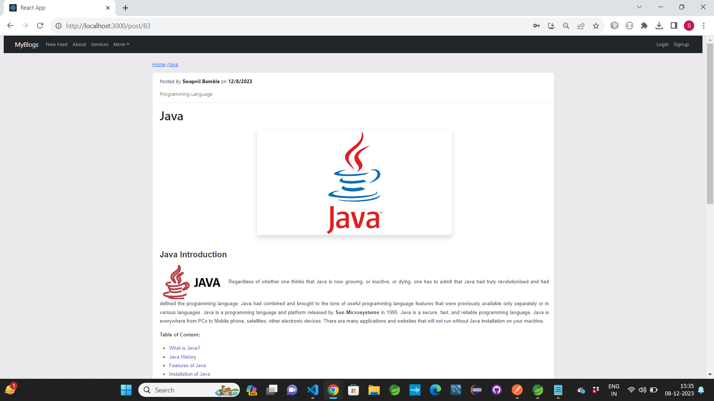
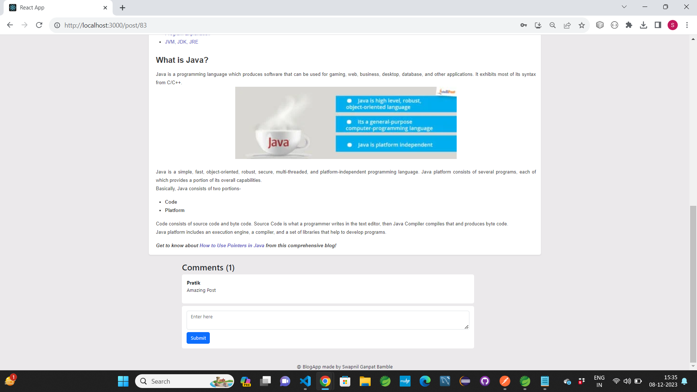
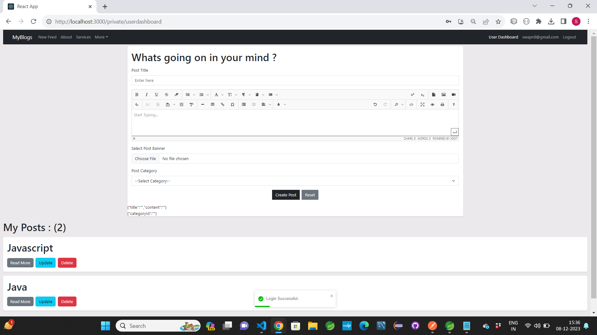
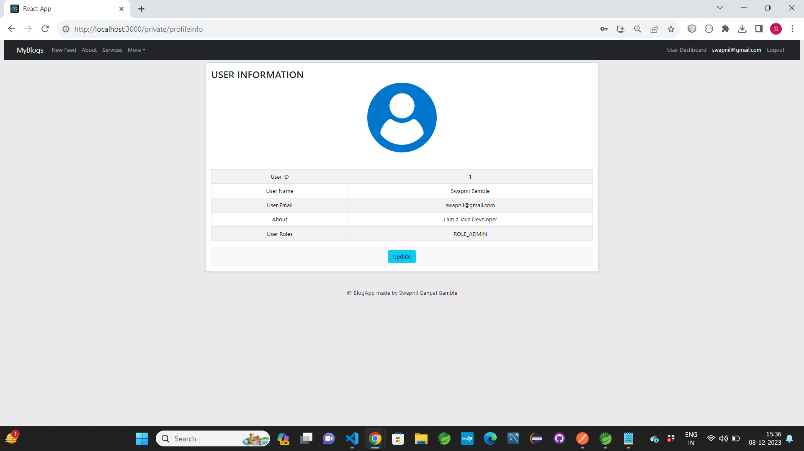
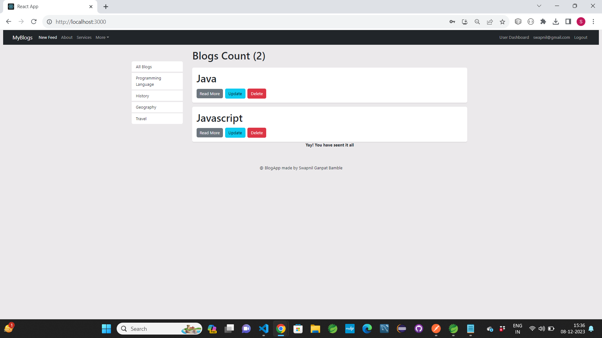
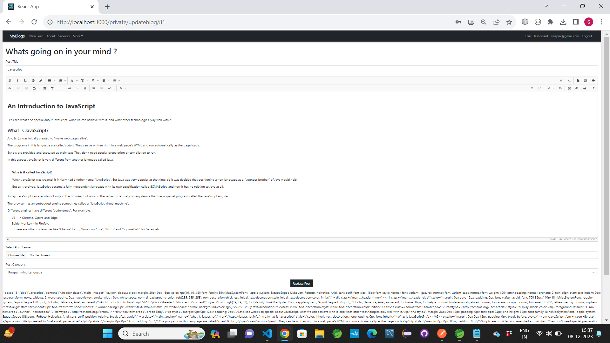
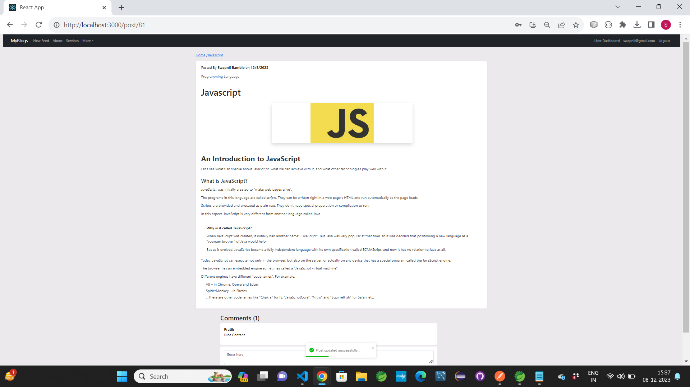

# BlogApp
## It is Blog Application. 
- It is Frontend Part, for Backend Part see url: https://github.com/swapnilbamble1438/BlogAppApis

### Software And Tools Used:
- Visual Studio
- Node JS v16.17.1

- React has been used for designing pages.

### Steps To Run The Project
- Import this Application.
- First Run its Backend Application from IDE.
- Then Start this Application:
- Open Visual Studio
- Open Terminal
- Go to root directory of Project folder (in "BlogAppReactGUI").
- then type ng serve
- it will start the Application
- and it will show the url in terminal at which the Application is going to run.
- Now open Browswer and try that URL.
- If everything goes right Application will run successfully.

- ### Some Screenshots of this Project:

==================================================================================================================================================================

==================================================================================================================================================================

==================================================================================================================================================================

==================================================================================================================================================================

==================================================================================================================================================================

==================================================================================================================================================================

==================================================================================================================================================================

==================================================================================================================================================================

==================================================================================================================================================================

==================================================================================================================================================================

### Project Creator: Swapnil Bamble

